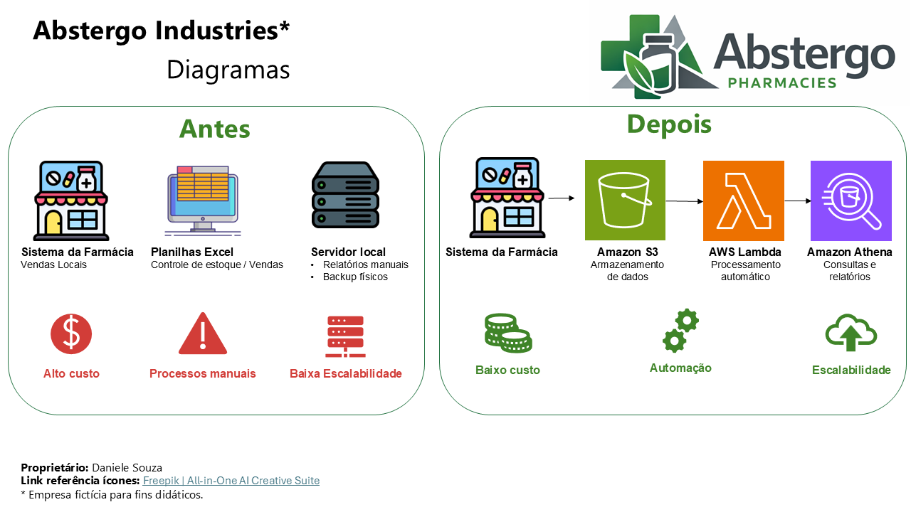
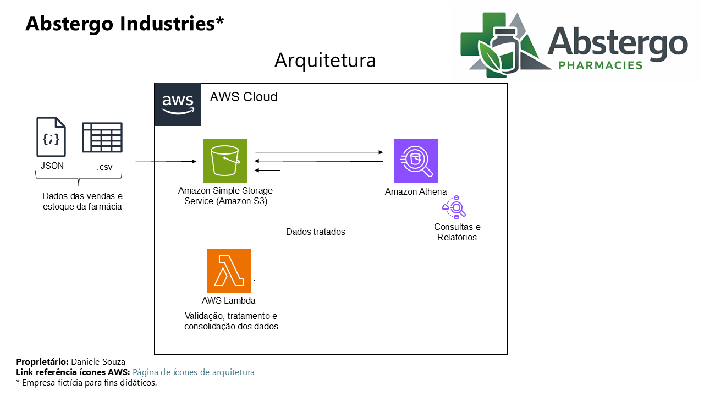

# RELATÓRIO DE IMPLEMENTAÇÃO DE SERVIÇOS AWS
---

**Data:** 18/01/2026

**Responsável:** Daniele Souza

---
## Introdução
Este relatório apresenta o processo de implementação de ferramentas na empresa **Abstergo Pharmacies** pertencente ao grupo **Abstergo Industries**, realizado por **Daniele Pereira de Souza**. O objetivo do projeto foi elencar 3 serviços AWS, com a finalidade de realizar a diminuição de custos imediatos.

---
## 📌 Contexto do Projeto (Cenário Fictício)

**Empresa:** Rede de Farmácias __Abstergo Pharmacies__

**Situação atual**
- Sistema de vendas (PDV) local em cada loja
- Planilhas Excel para controle de estoque
- Servidor físico on-premises para relatórios
- Falta de visibilidade de consumo e desperdício
- Custos altos com infraestrutura, retrabalho e perdas de estoque

## 🎯 Objetivo do projeto:
Reduzir custos operacionais de forma imediata, usando apenas 3 serviços AWS.

---

## 🧩 Visão Geral da Solução Proposta (3 Serviços AWS)

| Etapa | Serviço AWS   | Objetivo Principal                                      |
|------|----------------|----------------------------------------------------------|
| 1    | Amazon S3      | Reduzir custo de armazenamento e centralizar dados      |
| 2    | AWS Lambda     | Eliminar servidores e automatizar processos             |
| 3    | Amazon Athena  | Reduzir custo de relatórios e análises                  |

-----

## 🏗️ Diagramas ANTES e DEPOIS
A imagem abaixo apresenta a comparação do sistema atual x sistema proposto:

---
## 🚀 Implementação
O projeto de implementação de ferramentas foi dividido em 3 etapas, cada uma com seus objetivos específicos. A seguir, serão descritas as etapas do projeto:

---

## 🧱 ETAPA 1 – Amazon Simple Storage Service (Amazon S3)

**O que a ferramenta faz:** Serviço de armazenamento de objetos altamente durável, escalável e de baixo custo.

**Foco da ferramenta:** Redução de custo com armazenamento e backup.

**Como será usado neste projeto:** Todas as vendas diárias e movimentações de estoque das lojas são exportadas (CSV ou JSON) e os arquivos são enviados automaticamente para um bucket S3.

**O que a ferramenta vai substituir:**
- Servidor local
- HDs externos
- Backups manuais

**Problema que resolve:**
- Alto custo de infraestrutura física
- Risco de perda de dados
- Falta de centralização das informações

**Ganhos esperados:**
- 💰 Redução imediata de custo com servidores
- 🔐 Alta durabilidade
- 📦 Centralização dos dados da rede inteira

---

## ⚙️ ETAPA 2 – AWS Lambda

**O que a ferramenta faz:** Executa código sob demanda, sem necessidade de servidores.

**Foco da ferramenta:** Automação e eliminação de servidores

**Como será usado neste projeto:** Sempre que um arquivo chega ao S3, a ferramenta Lambda é acionada automaticamente e vlida os dados, remove duplicidades, consolida vendas por loja e produto e por fim salva os dados tratados novamente no S3.

**Problema que resolve:**
- Processos manuais de tratamento de dados
- Dependência de scripts rodando em servidores
- Custo fixo de máquinas ligadas 24h

**Ganhos esperados:**
- 💰 Custo zero quando não está em uso
- ⚡ Processamento automático
- 🧹 Dados prontos para análise

---

## 📊 ETAPA 3 – Amazon Athena

**O que a ferramenta faz:** Permite consultar dados no S3 usando SQL, sem banco de dados ou servidor.

**Foco da ferramenta:** Redução de custo com BI e relatórios.

**Como será usado neste projeto:** Analistas executam consultas SQL diretamente sobre os dados no S3, podendo identificar produtos com maior perda, vendas por loja, ruptura de estoque e receita, por exemplo.

**O que a ferramenta vai substituir:**
- Servidores de banco de dados
- Ferramentas de BI

**Problema que resolve:**
- Alto custo para gerar relatórios
- Dependência da área de TI
- Lentidão para tomar decisões

**Ganhos esperados:**
- 💰 Paga apenas por consulta executada
- 📈 Visibilidade rápida de custos e desperdícios
- 🧠 Decisões baseadas em dados

---

## 📁 Arquitetura proposta
A imagem abaixo apresenta a arquitetura de solução proposta para este projeto.

---
## 🧠 Conclusão

A implementação de ferramentas na empresa **Abstergo Pharmacies** pertencente ao grupo **Abstergo Industries** tem como esperado a redução de custos, automação de processos e permite escalabilidade da solução, o que aumentará a eficiência e produtividade da empresa. Recomenda-se a continuidade da utilização das ferramentas implementadas e a busca por novas tecnologias que possam melhorar ainda mais os processos da empresa.

**__Anexos__**

- [Diagrama](https://github.com/danielepsouza/servicos-aws-abstergo/blob/main/Diagrama.PNG): Permite visualizar o diagrama dos processos na farmácia antes e depois da solução proposta.
- [Arquitetura](https://github.com/danielepsouza/servicos-aws-abstergo/blob/main/Arquitetura.PNG): Desenho da arquitetura proposta para o projeto.

---
## 🎓 Responsável:
___Daniele Pereira de Souza___

- [Github](https://github.com/danielepsouza)
- LinkedIn: [Daniele Souza](https://www.linkedin.com/in/daniele-pereira-de-souza-7523a4189/)

---

